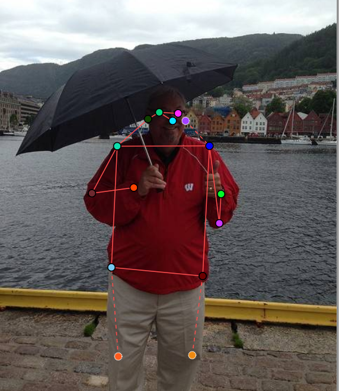
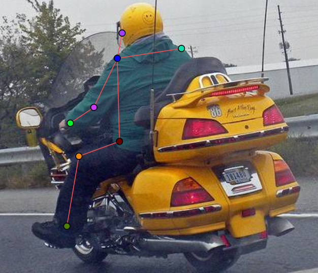
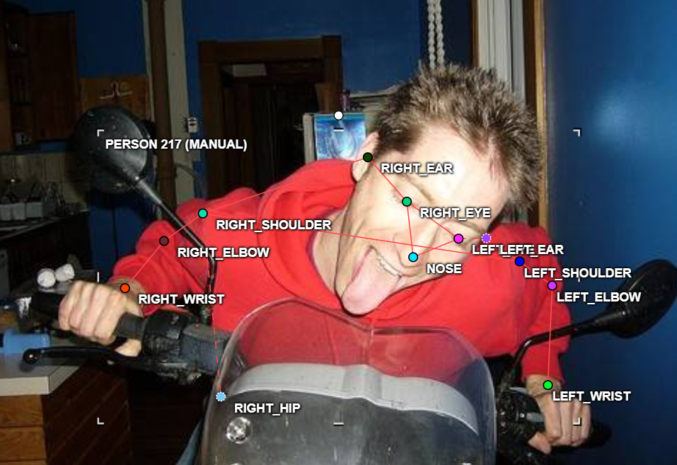
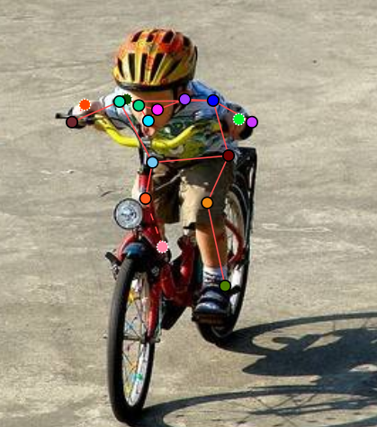
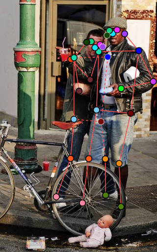
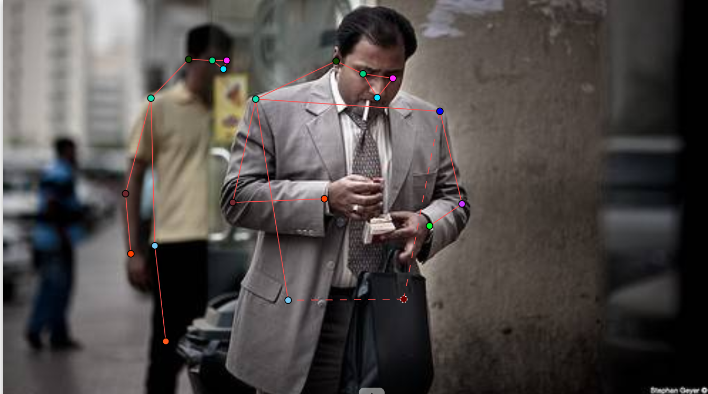

# Mini guideline - nhóm: ______  |  người gán: _Bùi Phương Nam____  |  ngày: __16/09/2026____

> Điền file này **trong lúc** gán nhãn, không phải sau khi xong. Mỗi lần bạn dừng lại
> hơn 10 giây để phân vân, đó là một dòng phải ghi vào đây.

## 1. Luật bắt buộc (đã thống nhất cả lớp - không sửa)

- Bộ 17 điểm COCO, đúng tên, đúng thứ tự. Lấy từ file `.SVG` chung.
- Mọi người trong ảnh đều có **đủ 17 điểm**. Điểm không dùng được thì gắn cờ, không xoá.
- Trái/phải tính theo **cơ thể người**, không theo bức ảnh.
- Bị che, còn trong khung -> `v = 1`, **vẫn đặt chấm** ở vị trí ước lượng.
- Ra ngoài mép ảnh -> `v = 0`, **không** đặt chấm.
- Không dùng `Hidden` (`h`) - nó không được lưu vào file.

## 2. Luật của nhóm bạn (phải điền)

| Tình huống | Luật nhóm bạn chọn | Vì sao |
| --- | --- | --- |
| Hông của người mặc quần áo dài | Vẫn chấm điểm keypoint hông và gán trạng thái bị che khuất (occluded / v=1). | Dựa vào cấu trúc giải phẫu cơ thể để xác định vị trí chính xác của xương hông mặc dù bị che phủ bởi trang phục bên ngoài. |
| Tai bị tóc hoặc mũ bảo hiểm che một phần | Chấm keypoint tai và đặt trạng thái occluded (v=1) nếu vẫn ước lượng được vị trí tương đối; nếu bị che kín hoàn toàn không thấy cơ sở hình ảnh thì cân nhắc bỏ qua v=0.  | Đảm bảo tính đồng bộ cho các khớp phần đầu, giúp mô hình học được vị trí cấu trúc khuôn mặt ngay cả khi có vật cản nhẹ. |
| Người bị cắt ở mép ảnh (chỉ thấy từ hông trở lên) | Chỉ gán nhãn các keypoint nằm bên trong biên khung hình; tuyệt đối không suy đoán hay chấm các keypoint nằm ở phần thân dưới đã bị cắt ra ngoài ảnh. | Theo quy chuẩn truncation, không gán nhãn các phần nằm ngoài biên khung hình vì không có dữ liệu hình ảnh thực tế. |
| Cổ tay nằm sau tay lái / sau thân mình | Vẫn định vị và chấm keypoint cổ tay, sau đó gán trạng thái occluded (v=1). | Khớp bị che khuất nhưng vẫn xác định được vị trí dựa trên góc nối từ khuỷu tay và bàn tay theo quy tắc giải phẫu. |
| Hai người chồng lên nhau | Gán đầy đủ keypoint cho từng người riêng biệt; các khớp của người ở phía sau bị che bởi người phía trước sẽ được gán trạng thái occluded (v=1). Nếu khớp của người bị che khuất không thể xác định được thì gán Outside (v=0) | Giúp phân tách rõ ràng các thực thể (instance) khác nhau trong cùng một khung hình nhiều người (multi-person pose). |
| Người nhỏ đến mức nào thì không gán nữa | Thống nhất ngưỡng (ví dụ: chiều cao nhân vật dưới 60/70 pixel hoặc các khớp quá mờ, không thể nhận diện rõ cấu trúc cơ thể tối thiểu). | Tránh đưa dữ liệu nhiễu, độ phân giải quá thấp vào tập huấn luyện khiến mô hình học kém chính xác. |

Với mỗi luật, chèn **một ảnh mẫu** (screenshot từ CVAT) thay vì chỉ viết một câu.
Slide 12 nói rõ: khớp không có bề mặt nhìn thấy được thì phải có ảnh mẫu, không phải
một câu văn chung chung.

## 3. Ba ca mơ hồ đã gặp (bắt buộc, ghi ít nhất 3)

### Ca 1 - ảnh `_train_04_____`, người thứ `_phụ nữ 1__`, khớp `__left_hip____`

- Mơ hồ ở chỗ nào: khớp xuất hiện trong khung hình nhưng bị che bởi vật cản xe máy
- Bạn quyết thế nào: tick Occluded cho khớp đó 
- Vì sao: căn cứ theo luật bắt buộc số 4  
- Nếu người khác quyết ngược lại thì model học sai cái gì: Mất khả năng suy luận vị trí khi bị che khuất.

### Ca 2 - ảnh `__train_06____`, người thứ `_nhất__`, khớp `_nose_____`

- Mơ hồ ở chỗ nào: người ngồi xe máy ngược lại với camera. cả người xuất hiện trên khung hình nhưng không xác định rõ phần khớp mũi ở vị trí nào 
- Bạn quyết thế nào: tick Outside cho khớp đó
- Vì sao: căn cứ vào luật của nhóm 
- Nếu người khác quyết ngược lại thì model học sai cái gì: Học sai tọa độ và cấu trúc giải phẫu, giảm độ tin cậy của mô hình.

### Ca 3 - ảnh `__train_13____`, người thứ `_đàn ông mặc áo xanh__`, khớp `__cả cơ thể người____`

- Mơ hồ ở chỗ nào: vẫn xác định được đó là người nhưng hình ảnh quá mờ không thể xác định các khớp
- Bạn quyết thế nào: bỏ qua người đó 
- Vì sao: căn cứ vào luật nhóm
- Nếu người khác quyết ngược lại thì model học sai cái gì: Nạp nhiễu và dữ liệu rác vào tập huấn luyện, suy giảm hiệu suất dự đoán.

## 4. Sau khi so visibility report với bạn cùng nhóm 
Làm cá nhân, không có bạn cùng nhóm.

- Khớp lệch `%v=1` nhiều nhất: `______` (bạn `___%` / họ `___%`)
- Nguyên nhân là **guideline chưa rõ** hay **một trong hai bên gán sai**:
- Luật mới bổ sung vào mục 2 sau khi thống nhất:
